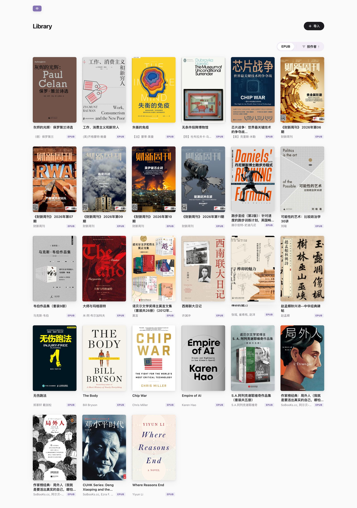
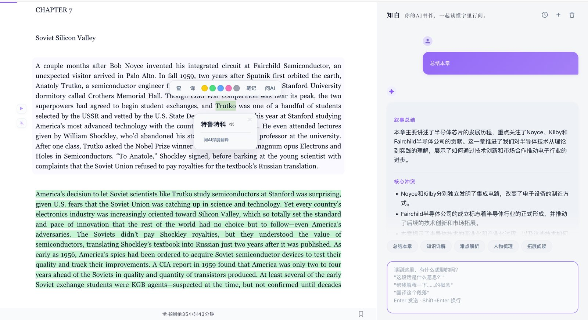
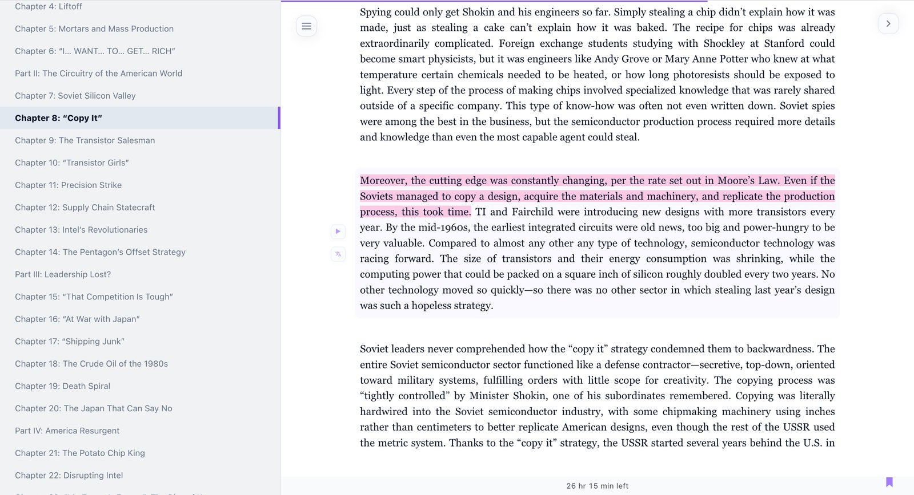
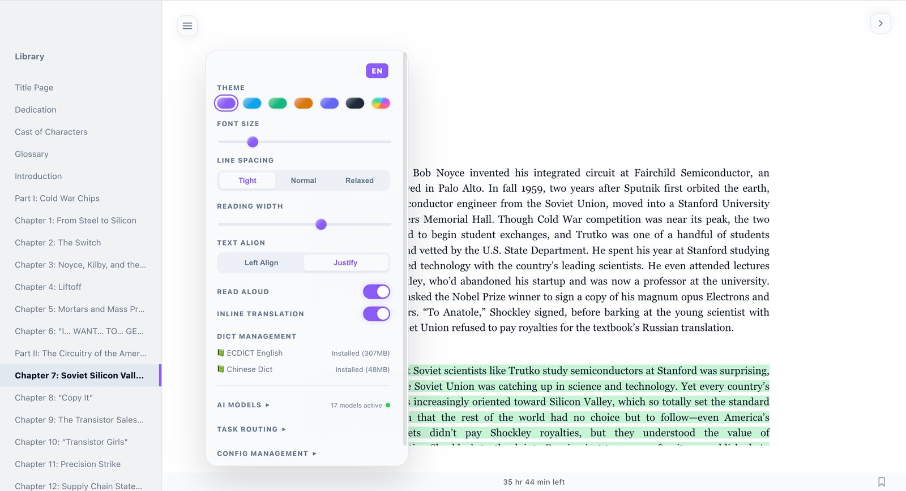
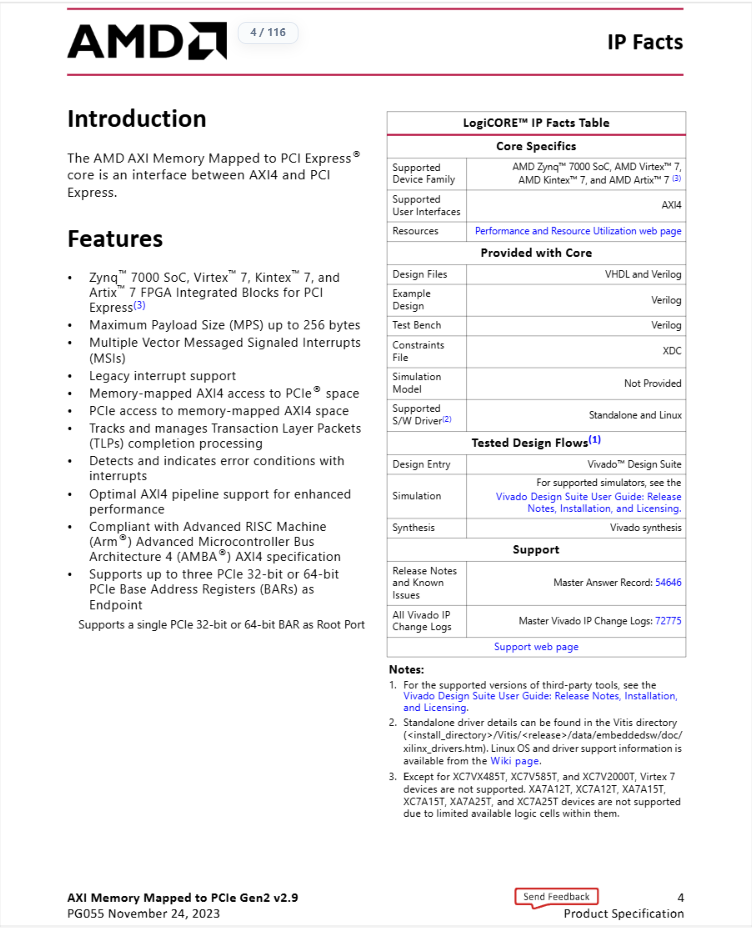
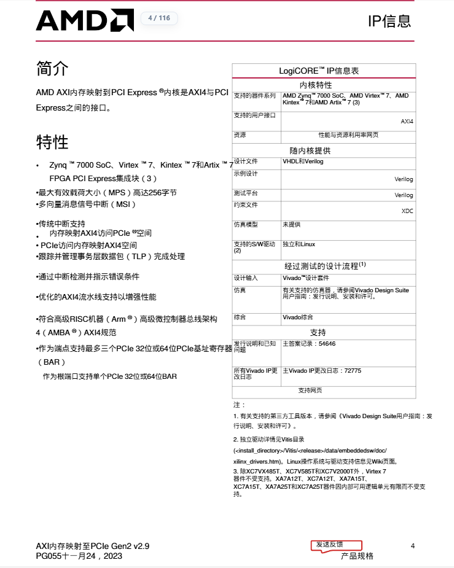
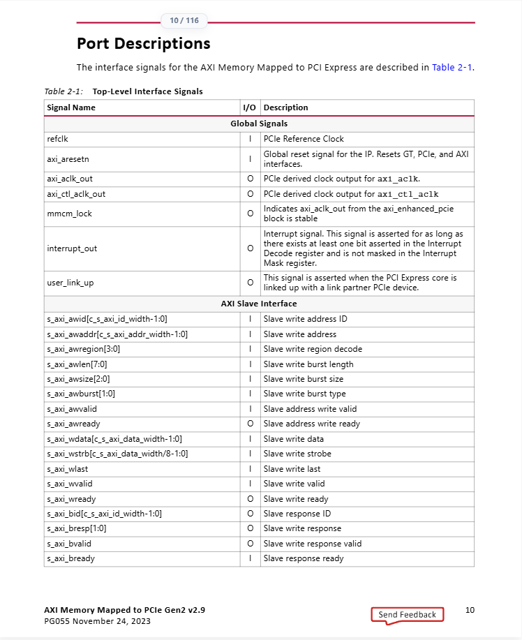
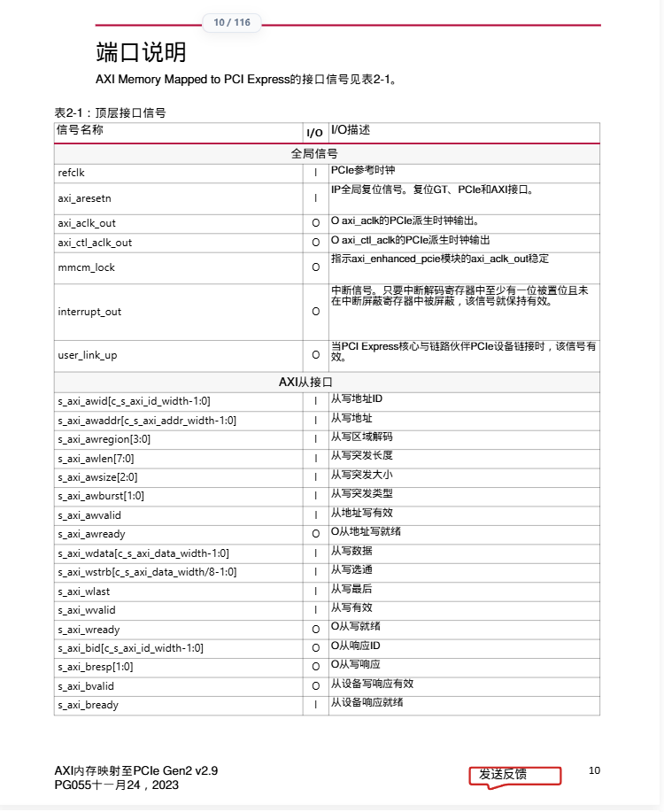
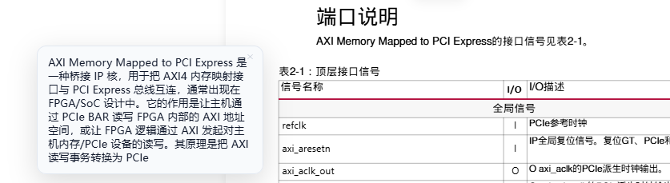
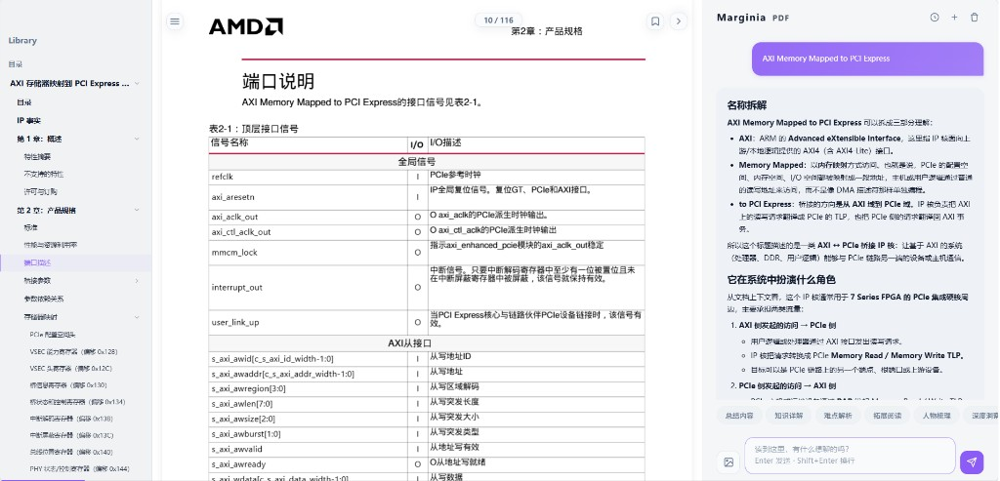

English | [简体中文](README.md)

# 🧊 FixedPDF

> "When technology is democratized by AI, aesthetics and human-centric design become the ultimate differentiators."

Inspired by Andrej Karpathy's [minimalist reader prototype](https://x.com/karpathy/status/1990577951671509438), FixedPDF is a locally deployed AI-powered e-book reader with built-in word lookup, AI translation & chat, TTS reading, and highlight notes — designed for deep reading.

📖 **Built-in sample book**: The repository includes "Meditations" by Marcus Aurelius (via Project Gutenberg), ready to explore after cloning.

<div align="center">
  <br>
  <sub>Your personal library at a glance</sub>
</div>

## ✨ Key Features

- 🔍 **Intuitive Discovery**: Highlight any text to reveal the action bar. Built-in support for **ECDICT** (English) and Chinese offline dictionaries.
- 🤖 **AI-Powered Reading**:
  - **Inline Translation**: High-quality, contextual translations elegantly embedded below the original text.
  - **AI Companion**: A sidebar AI assistant supporting streaming dialogue and multi-turn memory for deep engagement.
  - **Broad Compatibility**: Built-in support for OpenAI, Anthropic, Gemini, DeepSeek, Grok, Alibaba Cloud Bailian, Volcengine, Tencent Hunyuan, MiniMax, Moonshot, SiliconFlow, Cerebras, SambaNova, Groq, Mistral, DeepInfra, Together AI, OpenRouter, Zhipu AI, and ModelScope — 20 AI providers in total, plus custom OpenAI-compatible endpoints.

<div align="center">
  <br>
  <sub>Selection toolbar · Inline translation · AI companion sidebar</sub>
</div>

- 🔊 **TTS Reading**: Powered by Edge-TTS with multiple high-quality Chinese and English voices.
- ✏️ **Highlights & Notes**: 5-color highlighting, inline annotations, and bookmarks — all stored in your browser's **localStorage**.

<div align="center">
  <br>
  <sub>Three-column reading: TOC navigation · Immersive text · Multi-color highlights</sub>
</div>

- 🎨 **Minimalist Aesthetics**: 6 curated themes and a flexible 3-column layout (TOC / Content / AI), optimized for all devices.

<div align="center">
  <br>
  <sub>Themes, typography, dictionaries, AI models — all in one panel</sub>
</div>

## 📸 Demo

> Using AMD's *AXI Memory Mapped to PCI Express* datasheet (PG055) as an example. The highlight: **table structure, signal names and numbers stay true to the original document**.

### 1. Layout-Preserving Translation (IP Facts)

Original on the left, translation on the right. Cell boundaries, row heights and right-column alignment are all preserved. Identifiers such as `AMD Zynq™ 7000 SoC`, `AXI4`, `Vivado` and `54646` are kept verbatim — only prose is translated.

| Original | Translated |
|----------|------------|
|  |  |

### 2. Signal Table Translation (Port Descriptions)

Signal tables are where generic translators usually fail — they translate the signal names themselves, or break the columns. Here `refclk`, `axi_aresetn`, `s_axi_awlen[7:0]` and their bit widths are preserved exactly; only the `I/O` descriptions are translated, with borders and alignment intact.

| Original | Translated |
|----------|------------|
|  |  |

### 3. AI Term Explanation ("Look Up")

Select a term and hit **Look Up** — the AI explains *what it is*, not just a literal translation. Below, `AXI Memory Mapped to PCI Express` is broken down into its protocol role, working principle and typical use cases.



### 4. Reader Interface

TOC navigation on the left, document content in the middle, AI assistant panel on the right (with name breakdown, key-point analysis, and more). Supports bilingual comparison, word lookup, TTS and highlights.



## 🚀 Quick Start

This project uses [uv](https://docs.astral.sh/uv/) to manage the Python environment and dependencies.

### 1. Install uv
Ensure Python 3.10+ is available, then install `uv`:
```bash
curl -LsSf https://astral.sh/uv/install.sh | sh
```

### 2. Import a Book & Launch
```bash
# Import an EPUB e-book
uv run reader3.py your_book.epub

# Start the server
uv run server.py
```
Open your browser at: 👉 **http://localhost:8123**

### 3. Configure AI
Enter the reading interface, click **Settings** in the top-left corner, and configure your **AI Provider** and API Key (e.g., [get a free Gemini Key](https://aistudio.google.com/apikey)).

> [!TIP]
> **🚀 Easter Egg**: Anywhere on the page, enter **`↑ ↑ ↓ ↓ ← → ← → B A`** (Konami Code) to unlock the hidden **Advanced AI Routing Panel**.

## 🛡️ Privacy
- **Local First**: No data leaves your device unless you explicitly trigger an AI or TTS request.
- **No Account Required**: Your data is stored only in your browser's `localStorage`.

## 📚 User Guide
For detailed configuration (offline dictionaries, multi-device access, port settings), see the [User Guide](docs/GUIDE.md).

## 📄 License
[GNU AGPL-3.0 License](LICENSE)

> This project is distributed under AGPL-3.0 because it integrates [PyMuPDF](https://github.com/pymupdf/PyMuPDF) (AGPL-3.0). See [THIRD_PARTY_NOTICES.md](THIRD_PARTY_NOTICES.md) for third-party notices.
